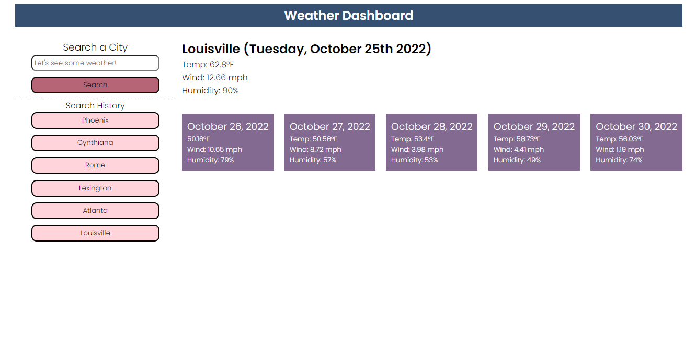

# Weather Dashboard

## Description
I wanted a website that could search for cities' weather for today and the next 5 days. I also wanted to be able to save the search history as clickable buttons. I used a server API to get the information for the weather and used multiple third party APIs for functionality. HTML and CSS were used to format and style the page.

I learned how to target attributes with click events.

I learned how to use server based APIs and get and sort thru the information they give me.

## Installation
This is N/A as it is a webpage and can be run without installing.

## Usage
This site is used for checking weather for different cities. By clicking the search box and typing different cities, you can bring up the weather and the forecast for the next five days. Clicking the buttons in the search history will bring up the search for that city.

Here's a link to the site: https://fruityokapi.github.io/Weather-Dashboard/

## Credits
jQuery: https://jquery.com

Bootstrap: https://getbootstrap.com

Google Font Used: https://fonts.google.com/specimen/Poppins?preview.text=Weather%20Dashboard&preview.text_type=custom

Forecast 5 API: https://openweathermap.org/forecast5

Color Pallete Generator: https://coolors.co / https://coolors.co/palette/355070-6d597a-c8bfe7-b56576-e56b6f

moment.js: https://momentjs.com

## License
The license is a default MIT license in the LICENSE.md file